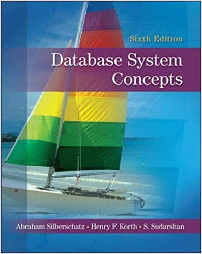

### **Index:**
- [Course Overview](#Course-Overview)
- [TextBooks](#TextBooks)
- [Slides and Papers](#Slides-and-Papers)

- [Class Time and Location](#Class-Time-and-Location)

## <a name="Course-Overview"></a>Course Overview:
```javascript
Database is a substantial core of every system. In this course, fundamental concepts of DB and DBMS will be to taught.
Main purpose is all students learn how to design and implement every systam. If we have time, we will discuss ORM (like Hibernate), XQuery and NoSQL.
```
## <a name="TextBooks"></a>TextBooks:

<table class="tg">
  <tr>
    <td class="tg-0lax"></td>
    <td class="tg-0lax"></td>
    <td class="tg-0lax"></td>
    <td class="tg-0lax"></td>
  </tr>
</table>

```
Main TextBooks:
```
* [An Introduction to Database Systems, By C.J. Date, 8th Edition, 2003]()
* [Fundamental of Database Systems, By R. Elmasri, 7th Edition, 2015]()
* [Database Systems, By T. Connolly and C. Begg, 6th Edition, 2014]()
* [Database System Concepts, By A. Silberschartz, H.F. Korth and S. Sudarshan, 6th Edition, 2010]()

## <a name="Class-Time-and-Location"></a>Class Time and Location:
Sunday and Tuesday 15:30-17:00 PM (Spring 2020), Room 203. 

# <a name="Grading"></a>Grading:

Endterm – 55% </br>
Midterm – 25% </br>
Homework and quiz –10%  </br>
Final Project - 10% </br>

### <a name="Two-Written-Exams"></a>Two Written Exams:
Midterm Examination: Tuesday 1399/02/16, 15:30-17:00 PM<br/>
Final Examination: Tuesday 1399/03/ <br/>

## <a name="Questions"></a>Questions?
You can meet me on Tuesday (13:30 PM--15:30 PM).
If It is not appropriate for you, email me at al_nazari@sbu.ac.ir or talk to me after class. 

