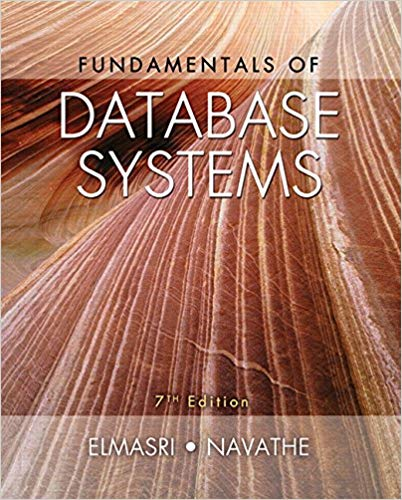

### **Index:**
- [Course Overview](#Course-Overview)
- [TextBooks](#TextBooks)
- [Slides and Papers](#Slides-and-Papers)

- [Class Time and Location](#Class-Time-and-Location)

## <a name="Course-Overview"></a>Course Overview:
```javascript
Database is a substantial core of every system. In this course, fundamental concepts 
of Database and DBMS will be to taught.
Main purpose is all students learn how to design and implement the data tier of every system. 
If we have time, we will discuss ORM (like Hibernate), XQuery and NoSQL.
```
## <a name="TextBooks"></a>TextBooks:

<table class="tg">
  <tr>
    <td class="tg-0lax"></td>
    <td class="tg-0lax"></td>
    <td class="tg-0lax"></td>
    <td class="tg-0lax"></td>
  </tr>
</table>

```
Main TextBooks:
```
* [An Introduction to Database Systems, By C.J. Date, 8th Edition, 2003](https://www.amazon.com/Introduction-Database-Systems-8th/dp/0321197844)
* [Fundamental of Database Systems, By R. Elmasri, 7th Edition, 2015](https://www.amazon.com/Fundamentals-Database-Systems-Ramez-Elmasri/dp/0133970779)
* [Database Systems: A Practical Approach to Design, Implementation, and Management (6th Edition)](https://www.amazon.com/Database-Systems-Practical-Implementation-Management/dp/0132943263) by By T. Connolly and C. Begg, 2014
* [Database System Concepts, By A. Silberschartz, H.F. Korth and S. Sudarshan, 6th Edition, 2010](https://www.amazon.com/Database-Concepts-Abraham-Silberschatz-Professor/dp/0073523321)
* [Database Systems: The Complete Book](http://infolab.stanford.edu/~ullman/dscb.html) by by Hector Garcia-Molina, Jeff Ullman, and Jennifer Widom, 2008.

```
Additional Resources:
```

## <a name="slides"></a>Recommended Courses and Slides:
1. [Full Database Course of Stanford](https://lagunita.stanford.edu) by Jennifer Widom
  This course comprises 14 mini courses from 'Introduction', 'Relational Design Theory', 'online Analytical Processing' to 'Recursion in SQL'.
 
 ## <a name='syllabus' />Syllabus
 1. An Overview of Database Management
 2. Database System Architecture
 3. An Introduction to Relational Databases
 4. An Introduction to SQL
 5. Relational Model: Relational Algebra, Relational Calculus
 6. Database Design: Functional Dependencies, Normalization
 
## <a name="Class-Time-and-Location"></a>Class Time and Location:
Sunday and Tuesday 15:30-17:00 PM (Spring 2020), Room 203. 

# <a name="Grading"></a>Grading:

Final Exam –55% </br>
Midterm Exam –25% </br>
Homework and quiz –10%  </br>
Final Project -10% </br>

### <a name="Two-Written-Exams"></a>Two Written Exams:
Midterm Examination: Tuesday 1399/02/16, 15:30-17:00 PM<br/>
Final Examination: Tuesday 1399/03/ <br/>

## <a name="Questions"></a>Questions?
You can meet me on Tuesday (13:30 PM--15:30 PM).
If It is not appropriate for you, email me at al_nazari@sbu.ac.ir or talk to me after class. 

